# Results

Full tables and figures for *Residential Mobility and Social Structure*.

> ### ⚠️ Provenance
>
> Everything on this page was produced by the **original analysis run**, before the refactor. Four defects were corrected in the code since (see README §5) — the ones that change numbers are marked **⚠️ changed after correction** below. Re-run `python/residential_mobility.ipynb` against the survey file to regenerate this page from the corrected code.
>
> Data: «Социальная структура», 09.03.2025. N = 7,563 respondents; N = 7,552 after removing implausible incomes.

---

## 1. The outcome variable

| | all moves since 16 | below 1.5 × IQR |
| --- | --- | --- |
| n | 7,563 | 7,288 |
| mean | 1.877 | 1.483 |
| SD | 3.051 | 1.728 |
| min | 0 | 0 |
| Q1 | 0 | 0 |
| median | 1 | 1 |
| Q3 | 3 | 2 |
| max | 99 | 7 |

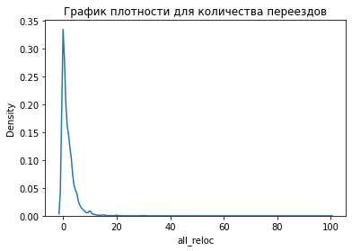 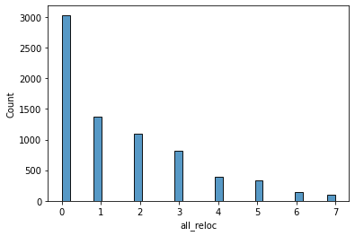

The raw count is heavily right-skewed (mean 1.88 vs median 1, maximum 99). Trimming at the 1.5 × IQR bound removes 275 respondents and brings the mean and median much closer together.

**Binary outcome.** `all_reloc > 3` → *hypermobile*.

| Group | n |
| --- | --- |
| Маломобильные (≤ 3 moves) | 6,321 |
| Сверхмобильные (> 3 moves) | 1,242 |

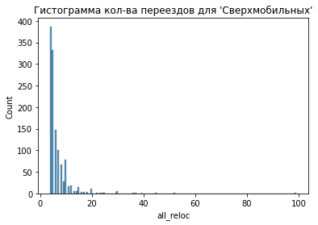

---

## 2. Descriptives

Split by mobility type; N = 7,552 after income cleaning. Categorical variables as n (%), numeric as mean (SD) — truncated below where the original rendered table was cut off.

| Variable | Маломобильные (N = 6,312) | Сверхмобильные (N = 1,240) | Overall (N = 7,552) |
| --- | --- | --- | --- |
| **relig** — Да | 4,643 (73.6 %) | 858 (69.2 %) | 5,501 (72.8 %) |
| — Нет | 1,669 (26.4 %) | 382 (30.8 %) | 2,051 (27.2 %) |
| **sex** — Женщина | 3,352 (53.1 %) | 712 (57.4 %) | 4,064 (53.8 %) |
| — Мужчина | 2,960 (46.9 %) | 528 (42.6 %) | 3,488 (46.2 %) |
| **children** — Да | 4,547 (72.0 %) | 998 (80.5 %) | 5,545 (73.4 %) |
| — Нет | 1,765 (28.0 %) | 242 (19.5 %) | 2,007 (26.6 %) |
| **work** — Да | 4,019 (63.7 %) | 713 (57.5 %) | 4,732 (62.7 %) |
| — Нет | 2,293 (36.3 %) | 527 (42.5 %) | 2,820 (37.3 %) |
| **home_owner**, mean (SD) | 1.4 (1.0) | 1.5 (1.2) | 1.4 (1.1) |
| — missing | 234 (3.7 %) | 47 (3.8 %) | 281 (3.7 %) |
| **age**, mean (SD) | 44.3 (14.3) | 49.5 (14.7) | 45.2 (14.5) |
| — median [IQR] | 43.0 [22.0] | 51.0 [25.0] | 44.0 [24.0] |
| **educ**, mean (SD) | 5.3 (1.8) | 5.5 (1.9) | 5.3 (1.9) |
| **personal_income**, mean (SD) | 58,184 (108,623) | 62,650 (288,636) | 58,917 (153,408) |
| — median [IQR] | 40,000 [50,000] | 40,000 [48,000] | 40,000 [50,000] |
| **volya**, mean (SD) | 3.1 (1.1) | 3.3 (1.1) | 3.1 (1.1) |
| **marrige** — Холост/не замужем | 1,298 (20.6 %) | 163 (13.1 %) | 1,461 (19.3 %) |
| — Женат/замужем | 3,223 (51.1 %) | 664 (53.5 %) | 3,887 (51.5 %) |
| — Разведён/на | 634 (10.0 %) | 177 (14.3 %) | 811 (10.7 %) |
| — Вдовец/вдова | 354 (5.6 %) | 86 (6.9 %) | 440 (5.8 %) |
| **educ** — Высшее научное | 168 (2.7 %) | 45 (3.6 %) | 213 (2.8 %) |
| — Высшее – специалитет | 1,440 (22.8 %) | 319 (25.7 %) | 1,759 (23.3 %) |
| — Среднее специальное | 1,594 (25.3 %) | 286 (23.1 %) | 1,880 (24.9 %) |
| — Общее среднее | 730 (11.6 %) | 119 (9.6 %) | 849 (11.2 %) |

Two notes on reading this table. `home_owner` is **nominal** (1 = the family owns the dwelling, 2 = the state, 5 = renting) but is reported as a mean because it was kept on its numeric scale for the cluster analysis — see README §6.2. Income is reported before the outlier trim, which is why the SD exceeds the mean.

---

## 3. Bivariate associations

Share of hypermobile respondents within each category. For ordered variables the pattern is monotone — which is the substantive finding.

| Variable | Category | n | % hypermobile |
| --- | --- | --- | --- |
| **Settlement type** | Москва | 594 | 12.1 |
| | Санкт-Петербург | 280 | 15.4 |
| | Город 1 млн+ | 810 | 16.2 |
| | Город 500–999 тыс. | 545 | 19.3 |
| | Город 100–499 тыс. | 1,503 | 17.3 |
| | Город 50–99 тыс. | 532 | 18.0 |
| | Город 10–49 тыс. | 943 | 14.7 |
| | Город < 10 тыс. | 108 | 18.5 |
| | Поселок городского типа | 579 | 15.4 |
| | Деревня, село, станица | 1,658 | 17.2 |
| **Religiosity** | Да | 5,501 | 15.6 |
| | Нет | 2,051 | 18.6 |
| **Education** | Начальное | 50 | 16.0 |
| | Неполное среднее | 276 | 16.3 |
| | Общее среднее | 849 | **14.0** |
| | Среднее специальное | 1,880 | 15.2 |
| | Среднее техническое | 1,335 | 15.5 |
| | Незаконченное высшее | 424 | 17.0 |
| | Высшее – специалитет | 1,759 | 18.1 |
| | Высшее – бакалавриат | 732 | 18.0 |
| | Высшее научное | 213 | **21.1** |
| | Научная степень | 34 | 20.6 |
| **Financial satisfaction** | Совершенно неудовлетворен/а | 1,292 | **19.4** |
| | В основном неудовлетворен/а | 1,450 | 17.0 |
| | В чём-то да, в чём-то нет | 2,824 | 16.6 |
| | В основном удовлетворен/а | 1,277 | 14.4 |
| | Полностью удовлетворен/а | 445 | **11.9** |
| | Затрудняюсь ответить | 264 | 14.8 |
| **Expected finances** | Значительно ухудшится | 580 | 19.0 |
| | Несколько ухудшится | 988 | **21.3** |
| | Не изменится | 1,889 | 16.9 |
| | Несколько улучшится | 1,781 | **14.3** |
| | Значительно улучшится | 1,215 | 14.5 |
| | Затрудняюсь ответить | 1,099 | 15.5 |
| **Willingness to change life** | Нет, не смог(ла) бы | 571 | 15.1 |
| | Скорее не смог(ла) бы | 1,147 | **12.6** |
| | В каких-то ситуациях мог(ла) бы | 2,850 | 16.1 |
| | Скорее смог(ла) бы | 1,547 | 18.6 |
| | Уверен, что смог(ла) бы | 791 | **21.9** |
| | Затрудняюсь ответить | 646 | 13.9 |
| **Housing type** | Собственный дом | 2,526 | 15.5 |
| | Однокомнатная квартира | 891 | 18.2 |
| | Двухкомнатная квартира | 2,035 | 15.2 |
| | Трёхкомнатная квартира | 1,386 | 15.7 |
| | Четырёхкомнатная и больше | 186 | 23.1 |
| | Комната в коммунальной квартире | 84 | **25.0** |
| | Комната в общежитии | 126 | 15.9 |
| | Комната в бараке | 57 | **28.1** |
| **Housing tenure** | Я и/или члены моей семьи | 6,306 | 16.2 |
| | Государство | 312 | **9.9** |
| | Организация | 77 | 18.2 |
| | Жилищный кооператив | 49 | 10.2 |
| | Мы снимаем жильё | 527 | **22.6** |
| **Children** | Да | 5,545 | 18.0 |
| | Нет | 2,007 | **12.1** |
| **Employment** | Да | 4,732 | 15.1 |
| | Нет | 2,820 | **18.7** |

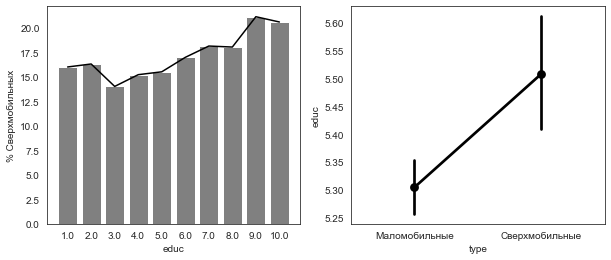 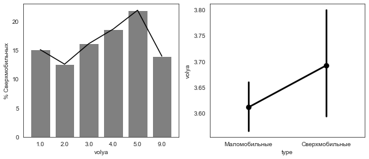
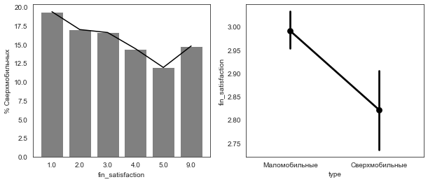 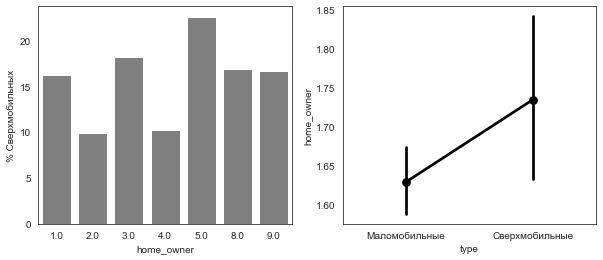

### Remaining bivariate figures

Each panel shows the share of hypermobile respondents by category (left) and the distribution of the variable across the two mobility types (right).

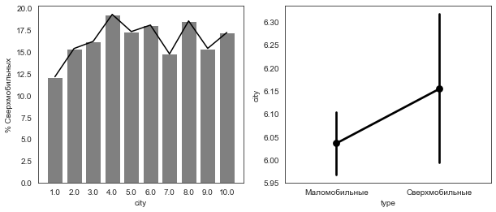 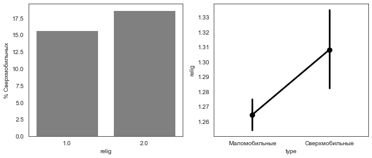
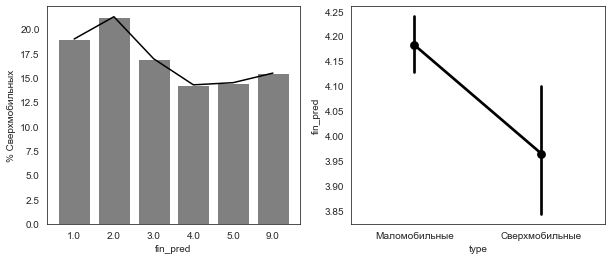 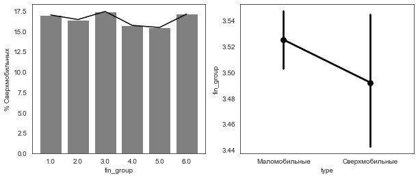
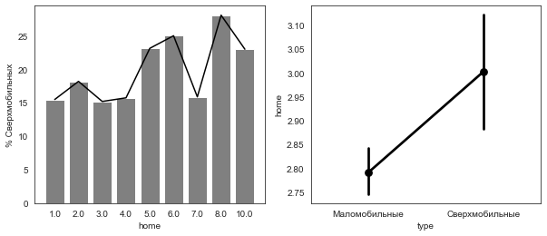 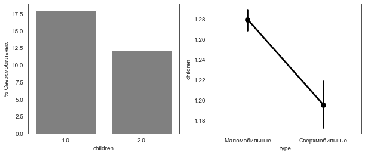
 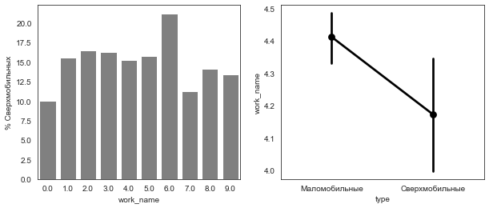

### Occupation (ISCO-08 unit groups, n > 15)

Only the ten groups with the highest share of hypermobile respondents. Groups with fewer than 16 respondents are excluded — several of these are based on ~20 people, so read them as leads rather than estimates.

| Occupation | n | % hypermobile |
| --- | --- | --- |
| Работники сферы торговли, не входящие в другие группы | 18 | 33.3 |
| Среднетехнический персонал на государственной службе | 22 | 31.8 |
| Смотрители зданий | 22 | 31.8 |
| Преподаватели в начальной школе | 21 | 28.6 |
| Работники служб охраны граждан | 30 | 26.7 |
| Техники в области физических и технических наук | 19 | 26.3 |
| Пекари, кондитеры | 23 | 26.1 |
| Инженеры по телекоммуникациям | 20 | 25.0 |
| Директора компаний и руководители высшего звена | 36 | 25.0 |
| Разработчики программного обеспечения | 38 | 23.7 |

Among the *larger* occupational groups the ranking is different from the popular image: qualified industrial workers show the lowest share (11.2 %, n = 625) and professionals the middle (16.4 %, n = 1,126).

### Income

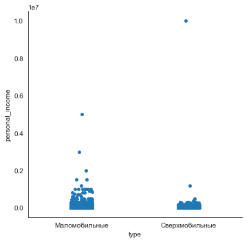 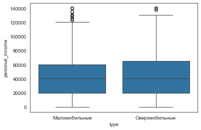

Two-sample t-test on IQR-trimmed personal income: **not significant**. Median personal income is identical in both groups (40,000 ₽). Whatever separates the mobile from the immobile, it is not current income.

---

## 4. Factor analysis

### Block B107 — causes of poverty, fairness, the role of authorities (17 items)

Five factors, **52.7 % cumulative explained variance**. Eigenvalues: 2.058, 1.856, 2.081, 1.382, 1.581.

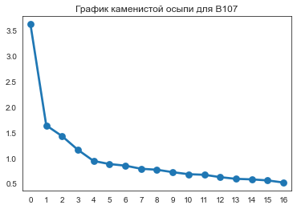

Loadings (blanked below |0.4|):

| Item | f0 | f1 | f2 | f3 | f4 |
| --- | --- | --- | --- | --- | --- |
| В107.3. Рабочие сами могут управлять производством | −0.400 | | **0.791** | | |
| В107.2. Среди управленцев слишком мало женщин | | | 0.437 | | |
| В107.4. Бедность — от нехватки ума | | **0.739** | | | |
| В107.5. Бедность — потому что не хотят работать | | **0.762** | | | |
| В107.6. Бедность — от низкой оплаты труда | **0.491** | | | | |
| В107.7. Бедность — предприятия закрылись | | | 0.578 | | |
| В107.8. Справедливо: у всех одинаковый уровень | | | 0.688 | | |
| В107.9. Справедливо: трудолюбивые живут лучше | **0.438** | | | | |
| В107.10. Справедливо: образованные живут лучше | | | | | 0.559 |
| В107.11. Право на бесплатное образование и медицину | **0.830** | | | | |
| В107.12. Обязан дать детям хорошее образование | **0.648** | | | | |
| В107.15. Только руководители выберут правильный путь | | | | | 0.850 |
| В107.16. Большинство не понимает своих интересов | **0.400** | 0.597 | | | |
| В107.17. Несколько сильных руководителей сделают больше | | | | | 0.501 |
| В107.13. Интересная работа важнее денег | | | | **−0.762** | |
| В107.14. Интересной работой можно пожертвовать | | | | **0.745** | |

Highest communalities: В107.3 (0.803), В107.15 (0.778), В107.13 (0.769), В107.11 (0.710), В107.4 (0.631).

Factor scores are named `sov_left`, `lib_cons`, `prog_left`, `money`, `merit`.

**⚠️ Note.** The `pattern()` display filter has been corrected (README §5.3). Large **negative** loadings below −0.4 may appear in this matrix after re-running — `f3` on В107.13 is the only one currently visible.

### Block B114 — individualism, collectivism, family obligation (19 items)

Four factors, **47.1 % cumulative explained variance**. Eigenvalues: 2.857, 2.503, 1.829, 1.759.

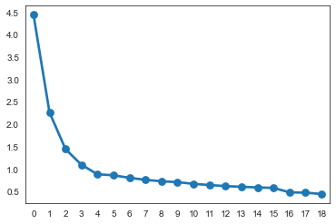

| Item | f2_0 | f2_1 | f2_2 | f2_3 |
| --- | --- | --- | --- | --- |
| В114.1. Нравится выделяться | | 0.697 | | |
| В114.2. Только я несу ответственность | | | | 0.540 |
| В114.3. Не беспокоюсь о мнении других | | | | 0.711 |
| В114.4. Полагаюсь только на свои силы | | | | 0.700 |
| В114.5. Огорчаюсь чужому успеху | | 0.792 | | |
| В114.6. Раздражаюсь, когда спорят | | 0.560 | | |
| В114.7. Коллективный результат важнее | | | 0.789 | |
| В114.9. Важно превосходить других | | 0.708 | | |
| В114.10. Пожертвую интересами ради семьи | 0.684 | | | |
| В114.12. Профессия выбрана с учётом мнения родителей | | 0.484 | | |
| В114.13. «Делу — время, потехе — час» | 0.623 | | | |
| В114.14. Радуюсь успеху коллег | | | 0.436 | |
| В114.15. Забота о родных важнее денег | 0.527 | | | |
| В114.16. Важны дружеские отношения с коллегами | 0.633 | | | |
| В114.17. Проблемы с соседями решаемы компромиссом | 0.545 | | | |
| В114.18. Советуюсь с близкими | 0.739 | | | |
| В114.19. Благополучие коллектива прежде своего | | | 0.774 | |

Highest communalities: В114.18 (0.718), В114.7 (0.652), В114.5 (0.643), В114.19 (0.612), В114.3 (0.566).

Factor scores are named `emot`, `ego`, `colect`, `ind`.

### Do the factor scores differ between the two groups?

| Factor | Маломобильные | Сверхмобильные | t | p |
| --- | --- | --- | --- | --- |
| B107 `sov_left` | −0.024 | 0.116 | 3.731 | 0.0002 |
| B107 `lib_cons` | 0.016 | −0.078 | −2.484 | 0.013 |
| B107 `prog_left` | 0.029 | −0.142 | −4.540 | < 0.0001 |
| B107 `money` | 0.000 | −0.001 | −0.038 | 0.969 |
| B107 `merit` | −0.001 | 0.007 | 0.216 | 0.829 |
| B114 `emot` | 0.005 | −0.026 | −0.916 | 0.360 |
| B114 `ego` | 0.025 | −0.124 | −4.304 | < 0.0001 |
| B114 `colect` | 0.024 | −0.121 | −4.194 | < 0.0001 |
| B114 `ind` | 0.008 | −0.040 | −1.403 | 0.161 |

Degrees of freedom: 5,074 (B107) and 6,087 (B114), complete cases within each block.

---

## 5. Cluster analysis

Clustering used complete linkage with city-block distance on min-max scaled numerics and one-hot encoded categoricals: religiosity, sex, children, housing tenure, employment, marital status, education, age, income, willpower, financial expectations and satisfaction, family income and housing-owner flag.

### Within the hypermobile subgroup (N = 976)

| Cluster | n |
| --- | --- |
| 0 | 107 |
| 1 | 364 |
| 2 | 225 |
| 3 | 280 |

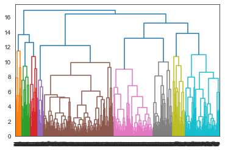

Cluster profile (mean (SD)):

| Variable | 0 (N=107) | 1 (N=364) | 2 (N=225) | 3 (N=280) | Overall (N=976) |
| --- | --- | --- | --- | --- | --- |
| home_owner | 4.2 (1.3) | 1.2 (0.9) | 1.0 (0.1) | 1.0 (0.2) | 1.4 (1.2) |
| age | 38.9 (12.9) | 49.1 (14.8) | 55.1 (15.5) | 49.8 (12.3) | 49.5 (14.7) |
| educ | 5.3 (2.1) | 5.6 (1.9) | 5.6 (1.7) | 6.0 (1.8) | 5.7 (1.9) |
| personal_income | 57,109 (49,561) | 85,146 (524,171) | 37,935 (29,260) | 72,384 (52,942) | 67,527 (322,329) |
| volya | 3.2 (1.1) | 3.2 (1.1) | 3.2 (1.1) | 3.4 (1.1) | 3.3 (1.1) |
| fin_pred | 3.4 (1.3) | 3.3 (1.2) | 2.9 (1.2) | 3.1 (1.2) | 3.2 (1.2) |
| fin_satisfaction | 2.5 (1.2) | 2.7 (1.1) | 2.5 (1.1) | 2.8 (1.0) | 2.7 (1.1) |
| fam_income | 81,601 (61,807) | 90,943 (91,357) | 57,297 (41,983) | 104,806 (87,382) | 86,140 (80,097) |
| relig = Да | 57.0 % | 100.0 % | 48.9 % | 46.1 % | 68.0 % |

Tests of cluster differences:

| Variable | Statistic | p | Test |
| --- | --- | --- | --- |
| home_owner | 752.45 | < 0.001 | Kruskal–Wallis |
| age | 92.87 | < 0.001 | Kruskal–Wallis |
| educ | 16.08 | < 0.001 | Kruskal–Wallis |
| personal_income | 79.23 | < 0.001 | Kruskal–Wallis |
| **volya** | **7.02** | **0.07** | Kruskal–Wallis |
| fin_pred | 18.06 | < 0.001 | Kruskal–Wallis |
| fin_satisfaction | 10.16 | 0.02 | Kruskal–Wallis |
| fam_income | 77.70 | < 0.001 | Kruskal–Wallis |
| relig | 275.63 | < 0.001 | χ² |
| sex | 466.06 | < 0.001 | χ² |
| children | 84.78 | < 0.001 | χ² |
| work | 415.18 | < 0.001 | χ² |
| marrige | 89.36 | < 0.001 | χ² |
| home_owner_bin | 752.95 | < 0.001 | χ² |

Cluster 1 is a striking artefact worth investigating: **100 % of its 364 members are religious**, which is why the χ² for `relig` is so large. Cluster 0 is defined by renters (mean `home_owner` = 4.2, i.e. "мы снимаем жильё") and is the youngest group (38.9 years). Clusters 2 and 3 are owners (mean 1.0) and differ mainly in age and income.

### Full sample (N = 5,854)

| Cluster | n |
| --- | --- |
| 0 | 388 |
| 1 | 1,756 |
| 2 | 383 |
| 3 | 3,327 |

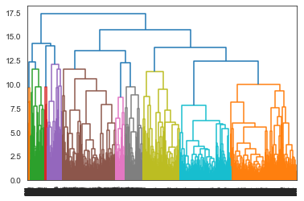

| Variable | 0 (N=388) | 1 (N=1,756) | 2 (N=383) | 3 (N=3,327) | Overall (N=5,854) |
| --- | --- | --- | --- | --- | --- |
| home_owner | 3.8 (1.4) | 1.0 (0.1) | 3.9 (1.4) | 1.0 (0.0) | 1.4 (1.1) |
| age | 38.9 (13.4) | 50.1 (17.0) | 36.9 (14.1) | 43.7 (12.1) | 44.9 (14.5) |
| educ | 4.9 (1.9) | 5.1 (1.8) | 5.0 (1.8) | 5.7 (1.8) | 5.5 (1.8) |
| personal_income | 57,684 (58,024) | 41,288 (75,745) | 65,108 (174,249) | 73,418 (189,382) | 62,194 (156,557) |
| volya | 3.1 (1.1) | 3.1 (1.1) | 3.1 (1.1) | 3.2 (1.1) | 3.1 (1.1) |
| fin_pred | 3.4 (1.2) | 3.1 (1.2) | 3.6 (1.1) | 3.4 (1.2) | 3.3 (1.2) |
| fin_satisfaction | 2.8 (1.1) | 2.6 (1.1) | 2.7 (1.2) | 2.9 (1.1) | 2.8 (1.1) |
| fam_income | 86,090 (94,580) | 77,715 (351,664) | 93,153 (176,120) | 107,577 (157,394) | 96,251 (232,288) |
| relig = Да | 63.9 % | 71.6 % | 75.5 % | 73.6 % | 72.5 % |

| Variable | Statistic | p | Test |
| --- | --- | --- | --- |
| home_owner | 5,797.59 | < 0.001 | Kruskal–Wallis |
| age | 416.01 | < 0.001 | Kruskal–Wallis |
| educ | 188.13 | < 0.001 | Kruskal–Wallis |
| personal_income | 606.71 | < 0.001 | Kruskal–Wallis |
| **volya** | **6.28** | **0.10** | Kruskal–Wallis |
| fin_pred | 72.87 | < 0.001 | Kruskal–Wallis |
| fin_satisfaction | 118.62 | < 0.001 | Kruskal–Wallis |
| fam_income | 432.78 | < 0.001 | Kruskal–Wallis |
| relig | 18.80 | < 0.001 | χ² |
| sex | 733.34 | < 0.001 | χ² |
| children | 75.91 | < 0.001 | χ² |
| work | 5,081.34 | < 0.001 | χ² |
| marrige | 258.49 | < 0.001 | χ² |
| home_owner_bin | 5,820.17 | < 0.001 | χ² |

**The full-sample solution is a housing-tenure split, not a mobility split.** Clusters 0 and 2 are renters (mean `home_owner` ≈ 3.8–3.9); clusters 1 and 3 are owners (mean 1.0). Because two of the five largest clusters come from a single binary variable, the very high χ² statistics for `work` (5,081) and `home_owner_bin` (5,820) largely reflect that separation rather than an independent finding. This is a limitation of the variable set, not a discovery about mobility.

`volya` is the only variable that fails to separate clusters in either run (p = 0.07 and p = 0.10).

---

## 6. Logistic regression

`type_bin ~ C(relig) + C(sex) + C(children) + C(work) + C(home_owner_bin) + age + educ + personal_income + volya + fin_pred + fin_satisfaction + fam_income`

**N = 6,016** · **Pseudo R² = 0.038** · significance: `*` p < 0.1, `**` p < 0.05, `***` p < 0.01

| Predictor | exp(B) | p |
| --- | --- | --- |
| `C(home_owner_bin)[T.1]` — family owns the dwelling | 0.706*** | < 0.01 |
| `C(relig)[T.2.0]` — not religious | 1.310*** | < 0.01 |
| `C(sex)[T.2.0]` — male | 1.214*** | < 0.01 |
| `C(work)[T.2.0]` — not employed | 1.099 | 0.23 |
| `C(children)[T.2.0]` — no children | 0.870 | 0.14 |
| age (per year) | 1.025*** | < 0.01 |
| educ (per level) | 1.071*** | < 0.01 |
| volya (per point, 1–5) | 1.210*** | < 0.01 |
| fin_satisfaction (per point) | 0.936* | < 0.1 |
| personal_income | 1.000* | < 0.1 |
| fin_pred | 0.997 | 0.93 |
| fam_income | 1.000 | 0.35 |
| Intercept | 0.032*** | < 0.01 |

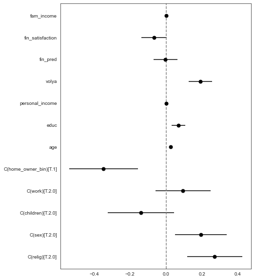

**⚠️ `home_owner_bin` is the coefficient affected by correction 2** (README §5.2). In the original run the missing codes were folded into "does not own", so the flag mixed in 281 respondents who gave no answer. The odds ratio of 0.706 is the pre-correction estimate and will shift after re-running.

**⚠️ The forest plot above is the pre-correction version.** In the original it plotted log-odds coefficients while the table reported odds ratios; the corrected function puts both on the odds-ratio scale.

**Direction of the effects.** Ownership of the dwelling is associated with *lower* odds of being hypermobile (OR 0.71), and so is financial satisfaction (0.94); age, education, willingness to change one's life and being male are associated with *higher* odds. Income is statistically indistinguishable from 1 in practical terms — the effect is significant only because N is large.

**Pseudo R² = 0.038 is the headline.** The full sociodemographic block explains under 4 % of the variation in mobility. Four out of twelve predictors are not significant, and the two income variables have odds ratios of 1.000.

### VIF diagnostics

**⚠️ Recomputed after correction 4** (README §5.4) — the values below were produced on the raw columns rather than on the model design matrix, so they do not correspond to any estimated coefficient. The corrected version builds the design matrix from the model formula; expect different (and lower) values.

| Variable | VIF (original, on raw columns) |
| --- | --- |
| age | 11.3 |
| fin_pred | 10.79 |
| work | 9.7 |
| sex | 9.4 |
| educ | 9.35 |
| fin_satisfaction | 9.1 |
| volya | 8.89 |
| children | 8.8 |
| relig | 8.55 |
| home_owner_bin | 6.6 |
| fam_income | 1.26 |
| personal_income | 1.24 |

Values of 8–11 for six variables that share no substantive overlap are the signature of a computation on the wrong matrix in which categorical variables entered as single numeric codes. Do not interpret them as evidence of multicollinearity.

---

## 7. What is not in this analysis

Listed so that the gaps are visible:

* **No sampling weights**, so all shares are sample statistics.
* **No causal identification** — the design is cross-sectional and mobility is measured retrospectively.
* **No distinction between voluntary and forced moves.** Eviction, family relocation and a career move are coded identically in `all_reloc`. This is the single largest conceptual limitation of the outcome variable.
* **Income is measured at one point in time** (2025), while moves are accumulated over the whole life course — a temporal mismatch that plausibly explains why income does not predict mobility.
* **The "difficult to answer" category is discarded rather than modelled.** If non-response is systematic (and for income and financial satisfaction it usually is), complete-case estimation is biased.
* **No comparison with the 2015 wave**, although the file was available (README §6.5).
